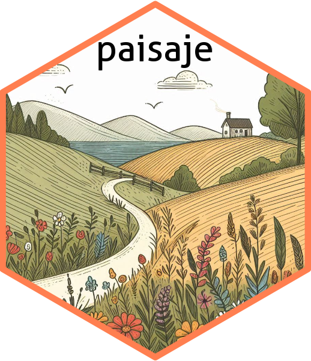

<!-- README.md is generated from README.Rmd. Please edit that file -->

```{r, include = FALSE}
knitr::opts_chunk$set(
  collapse = TRUE,
  comment = "#>",
  fig.path = "man/figures/README-",
  out.width = "100%"
)
```

<div style="display: flex; align-items: center; margin-bottom: 20px;">
  
  <h1 style="margin: 0; border: none; padding: 0;">paisaje</h1>
</div>

[](https://github.com/ManuelSpinola/paisaje/actions/workflows/R-CMD-check.yaml)
[](LICENSE)

# paisaje

**paisaje**: Tools for spatial and landscape/habitat analysis.

## Overview

**paisaje** is an R package for calculating **landscape metrics** and performing **spatial analysis** over raster and vector data, including **H3 hexagonal grids**.  
It provides tools to quantify habitat structure, fragmentation, and landscape patterns, supporting ecological research, environmental monitoring, and spatial data integration using hierarchical grid systems.

Key features include:

- Calculation of landscape metrics for categorical raster layers  
- Generation and analysis of H3 hexagonal grids for spatial modeling  
- Integration with spatial packages like **terra** and **sf**  
- Flexible extraction of metrics at different spatial resolutions  
- Functions for habitat and landscape characterization  

By combining powerful spatial analysis tools with a user-friendly API, **paisaje** facilitates landscape ecology studies, habitat assessment, and spatial modeling workflows.

## Installation

You can install the development version of **paisaje from** [GitHub](https://github.com/) using one of the following methods:

```{r, eval=FALSE}
# install.packages("pak")
pak::pak("ManuelSpinola/paisaje")
```

```{r, eval=FALSE}
# install.packages("remotes")
remotes::install_github("ManuelSpinola/paisaje")
```


```{r, eval=FALSE}
install.packages("devtools")
devtools::install_github("ManuelSpinola/paisaje")
```

## License
This package is released under the MIT License.


