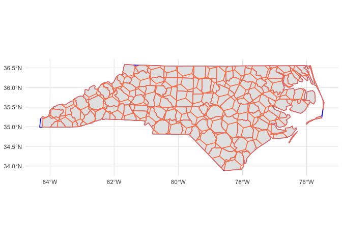

paisaje: tools for landscape analysis
================

<!-- README.md is generated from README.Rmd. Please edit that file -->

# paisaje

<!-- badges: start -->
<!-- badges: end -->

The goal of paisaje is to provide tools for landscape analysis.

## Installation

You can install the development version of paisaje from
[GitHub](https://github.com/) with:

``` r
# install.packages("pak")
pak::pak("ManuelSpinola/paisaje")
```

## Example

This is a basic example which shows you how to use the package:

``` r
library(paisaje)
library(tidyverse)
library(sf)
library(h3jsr)
```

Let’s bring an sf object

``` r
nc = st_read(system.file("shape/nc.shp", package="sf"))
#> Reading layer `nc' from data source 
#>   `/Library/Frameworks/R.framework/Versions/4.4-arm64/Resources/library/sf/shape/nc.shp' 
#>   using driver `ESRI Shapefile'
#> Simple feature collection with 100 features and 14 fields
#> Geometry type: MULTIPOLYGON
#> Dimension:     XY
#> Bounding box:  xmin: -84.32385 ymin: 33.88199 xmax: -75.45698 ymax: 36.58965
#> Geodetic CRS:  NAD27
```

Create an h3 grid of resolution 5

``` r
h3_grid_nc <- get_h3_grid(nc, resolution = 5)
```

Make a map

``` r
ggplot() +
  geom_sf(data = h3_grid_nc)
```


