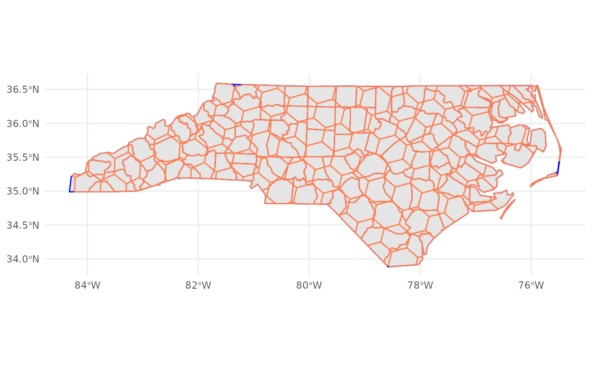

# paisaje: landscape analysis

The goal of **paisaje** is to provide tools for spatial and landscape
analysis in R. It includes functions for working with landscape metrics,
spatial data manipulation, and biodiversity conservation applications.

## Installation

You can install the development version of paisaje from
[GitHub](https://github.com/) with:

``` r

install.packages("devtools")
devtools::install_github("ManuelSpinola/paisaje")
```

## Example

This is a basic example which shows you how to use the package:

``` r

library(paisaje)
library(ggplot2)
library(sf)
library(h3jsr)
```

Let’s bring an sf object

``` r

nc = st_read(system.file("shape/nc.shp", package="sf"))
```

    ## Reading layer `nc' from data source 
    ##   `/home/runner/work/_temp/Library/sf/shape/nc.shp' using driver `ESRI Shapefile'
    ## Simple feature collection with 100 features and 14 fields
    ## Geometry type: MULTIPOLYGON
    ## Dimension:     XY
    ## Bounding box:  xmin: -84.32385 ymin: 33.88199 xmax: -75.45698 ymax: 36.58965
    ## Geodetic CRS:  NAD27

Create an h3 grid of resolution 4

``` r

h3_grid_nc <- get_h3_grid(nc, resolution = 4)
```

Make a map

``` r

ggplot() +
  theme_minimal() +
  geom_sf(data = nc, color = "blue", linewidth = 0.5) +
  geom_sf(data = h3_grid_nc, alpha = 0.4, color = "coral", linewidth = 0.5)
```


