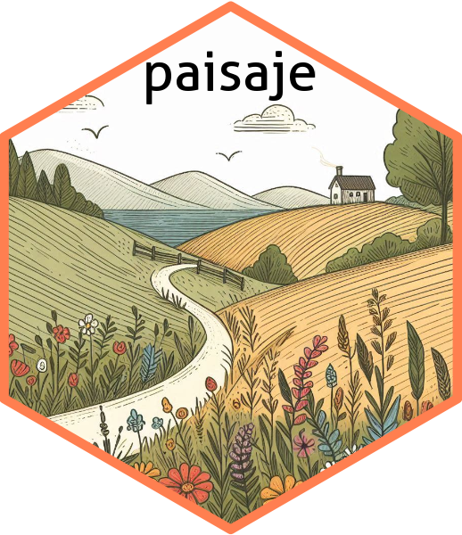

# paisaje



# paisaje

**paisaje**: Tools for spatial and landscape/habitat analysis.

## Overview

**paisaje** is an R package for calculating **landscape metrics** and
performing **spatial analysis** over raster and vector data, including
**H3 hexagonal grids**.  
It provides tools to quantify habitat structure, fragmentation, and
landscape patterns, supporting ecological research, environmental
monitoring, and spatial data integration using hierarchical grid
systems.

Key features include:

- Calculation of landscape metrics for categorical raster layers  
- Generation and analysis of H3 hexagonal grids for spatial modeling  
- Integration with spatial packages like **terra** and **sf**  
- Flexible extraction of metrics at different spatial resolutions  
- Functions for habitat and landscape characterization

By combining powerful spatial analysis tools with a user-friendly API,
**paisaje** facilitates landscape ecology studies, habitat assessment,
and spatial modeling workflows.

## Installation

You can install the development version of **paisaje from**
[GitHub](https://github.com/) using one of the following methods:

``` r

# install.packages("pak")
pak::pak("ManuelSpinola/paisaje")
```

``` r

# install.packages("remotes")
remotes::install_github("ManuelSpinola/paisaje")
```

``` r

install.packages("devtools")
devtools::install_github("ManuelSpinola/paisaje")
```

## License

This package is released under the MIT License.
